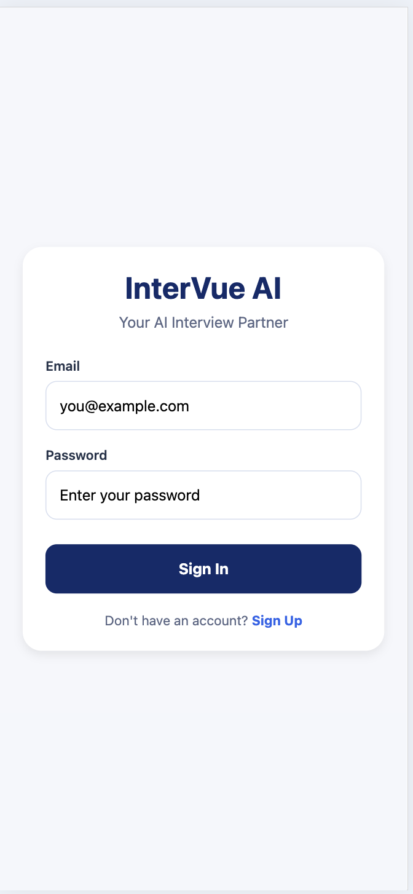
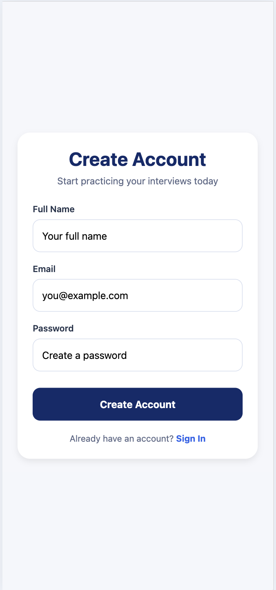
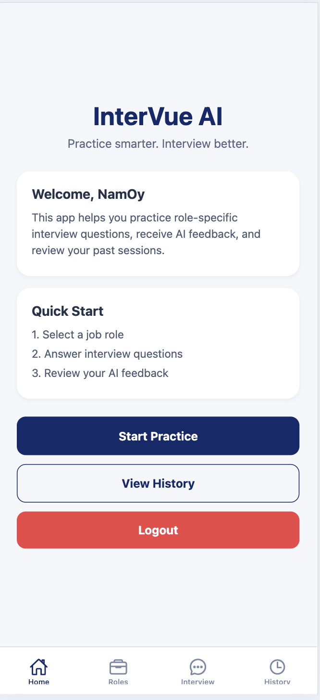
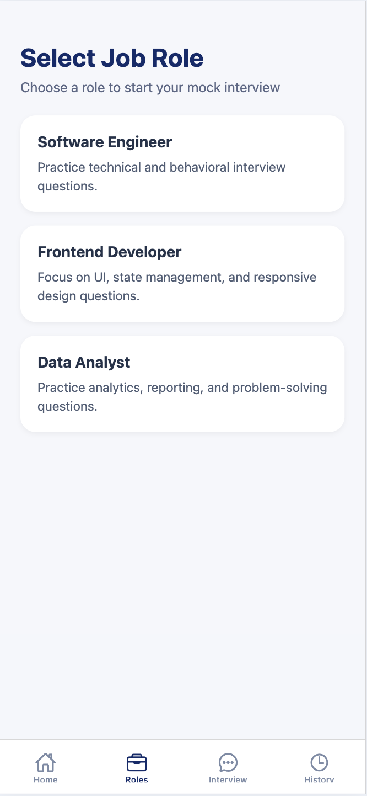
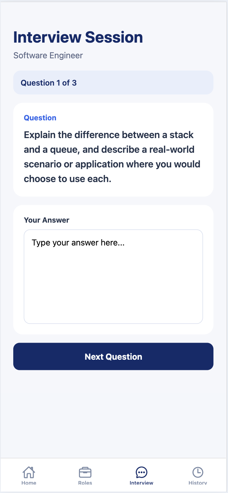
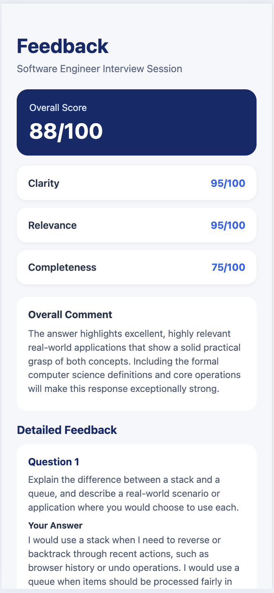
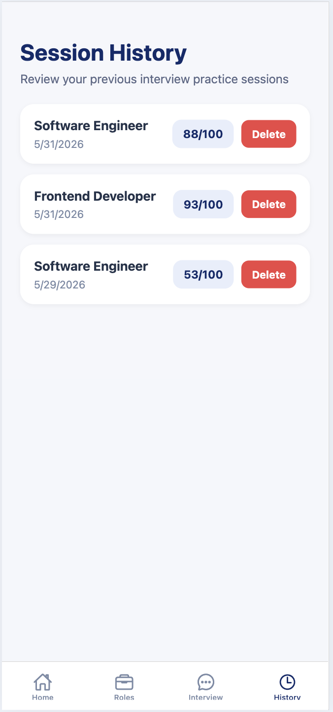
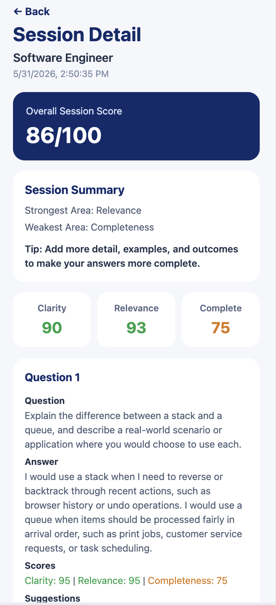

# InterVue AI

InterVue AI is a mobile-first mock interview application that helps students and job seekers practice interview questions, receive structured feedback, and review previous interview sessions. The project was developed as a capstone application with a focus on practical interview preparation, role-based question generation, answer evaluation, and session history tracking.

## Overview

The application allows users to:
- create an account and log in securely
- select a target job role
- practice role-based mock interview questions
- receive structured feedback on their answers
- review previous interview sessions
- revisit detailed feedback for each session
- retake interviews for additional practice

The system is designed to support both web and mobile use.

---

## Features

- User registration and login
- Role-based interview practice
- AI-supported question generation and answer evaluation
- Structured feedback with scoring
- Session history tracking
- Detailed session review
- Retake interview flow
- Delete session history
- Web and mobile support

---

## Tech Stack

### Frontend
- React Native
- Expo
- Expo Router
- Axios

### Backend
- Node.js
- Express.js
- MongoDB
- Mongoose
- JWT Authentication

### AI Integration
- Gemini API
- Optional fallback mock evaluation

---

## Project Structure

```text
ai-mock-interview/
├── mobile/
│   ├── app/
│   │   ├── (tabs)/
│   │   │   ├── index.tsx
│   │   │   ├── roles.tsx
│   │   │   ├── interview.tsx
│   │   │   └── history.tsx
│   │   ├── index.tsx
│   │   ├── login.tsx
│   │   ├── register.tsx
│   │   ├── feedback.tsx
│   │   └── session-detail.tsx
│   └── services/
│       └── api.ts
│
├── server/
│   ├── src/
│   │   ├── routes/
│   │   │   ├── authRoutes.js
│   │   │   ├── interviewRoutes.js
│   │   │   └── historyRoutes.js
│   │   ├── middleware/
│   │   │   └── authMiddleware.js
│   │   ├── app.js
│   │   ├── server.js
│   │   ├── User.js
│   │   ├── InterviewSession.js
│   │   └── aiService.js
│   └── .env
└── README.md
```

---

## Installation

### 1. Clone the repository

```bash
git clone <your-repository-url>
cd ai-mock-interview
```

### 2. Install backend dependencies

```bash
cd server
npm install
```

### 3. Install frontend dependencies

```bash
cd ../mobile
npm install
```

---

## Environment Variables

Create a `.env` file inside the `server` folder.

### Example

```env
PORT=5001
MONGODB_URI=mongodb://127.0.0.1:27017/ai_mock_interview
JWT_SECRET=your_super_secret_key_123
GEMINI_API_KEY=your_gemini_api_key_here
GEMINI_MODEL=gemini-2.5-flash
```

If you use a different AI provider, update the AI-related variables accordingly.

---

## Running the Project

### Start the backend

```bash
cd server
npm run dev
```

### Start the frontend

```bash
cd mobile
npx expo start
```

### Run on web

Press:

```bash
w
```

or run directly:

```bash
npx expo start --web
```

### Run on mobile

Use Expo Go on your phone.

If testing on a real phone, update `mobile/services/api.ts` to use your computer’s local IP address.

Example:

```ts
const BASE_URL = 'http://192.168.1.23:5001/api';
```

For web on the same machine, `localhost` is fine:

```ts
const BASE_URL = 'http://localhost:5001/api';
```

---

## API Endpoints

### Authentication
- `POST /api/auth/register`
- `POST /api/auth/login`

### Interview
- `POST /api/interview/generate`
- `POST /api/interview/evaluate`

### History
- `GET /api/history`
- `GET /api/history/:id`
- `DELETE /api/history/:id`

---

## Main Workflow

1. The user registers or logs in
2. The user selects a target job role
3. The system generates role-based interview questions
4. The user submits text-based answers
5. The system evaluates the answers and returns structured feedback
6. The session is saved in MongoDB
7. The user can review past sessions in the history page
8. The user can open detailed session feedback and retake the interview

---

## Database Usage

MongoDB is used as the main database of the system. It stores:

- user accounts
- selected job roles
- interview questions
- submitted answers
- AI feedback
- session history
- detailed session records

This allows users to review previous interview performance and continue practicing over time.

---

## Screenshots

### Login


### Register


### Home


### Role Selection


### Interview


### Feedback


### History


### Session Detail

```

---

## How to Demo

A simple demo flow for presentation:

1. Open the application
2. Register a new user account
3. Log in with the created account
4. Show the home page
5. Go to the roles page
6. Select a role
7. Answer the generated interview questions
8. Submit the answers
9. Show the feedback page
10. Open the history page
11. Open a session detail page
12. Demonstrate retake interview
13. Demonstrate delete session history
14. Log out

---

## Web and Mobile Notes

- Web uses `localStorage` for token persistence
- Mobile uses `SecureStore`
- For web testing, use `localhost`
- For real phone testing, use your computer’s local IP address

---

## Current MVP Scope

The current MVP includes:

- user authentication
- role selection
- interview question generation
- answer submission
- structured feedback
- session history
- session detail review
- retake interview
- delete session history

---

## Future Improvements

Possible future improvements include:

- forgot password
- profile management
- email verification
- additional job roles
- improved analytics dashboard
- export feedback summary
- favorite interview sessions

---

## Notes

- If AI quota or API access becomes unavailable, the system can be extended with a fallback mock evaluation mode
- The project is intended for educational and capstone purposes

---

## Author

**Siraphat Mingsorn**

---

## License

This project is for educational and academic use.
